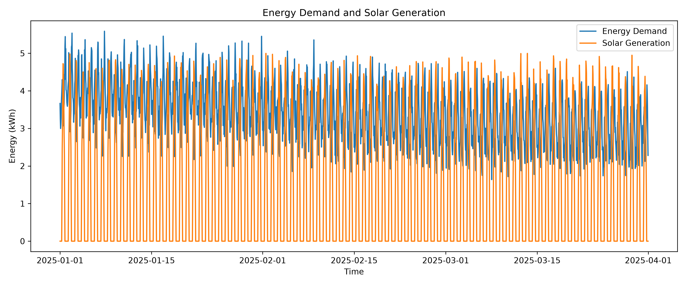
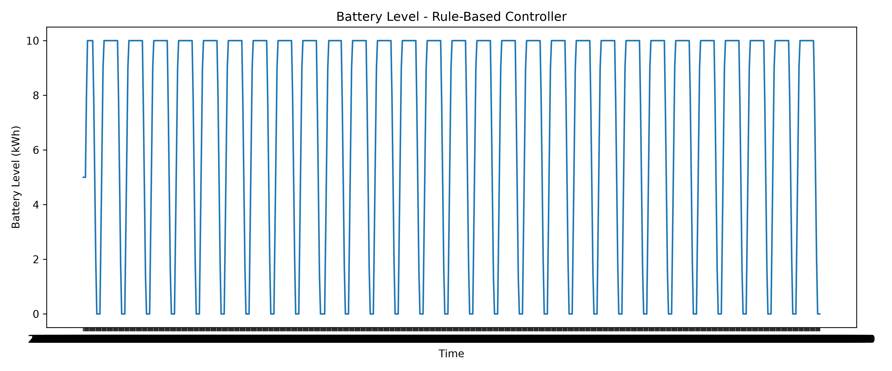
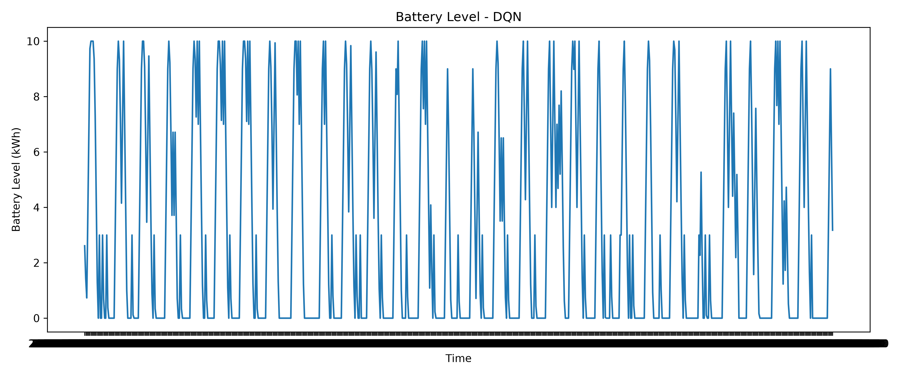
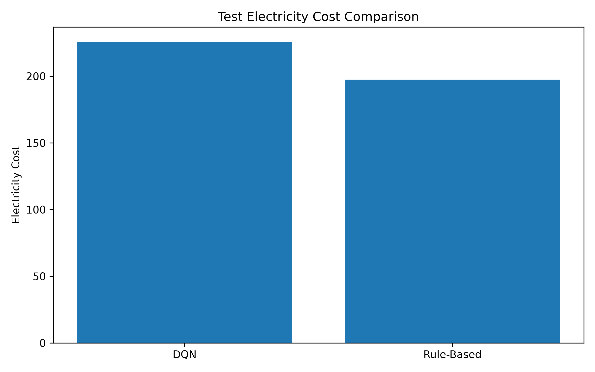
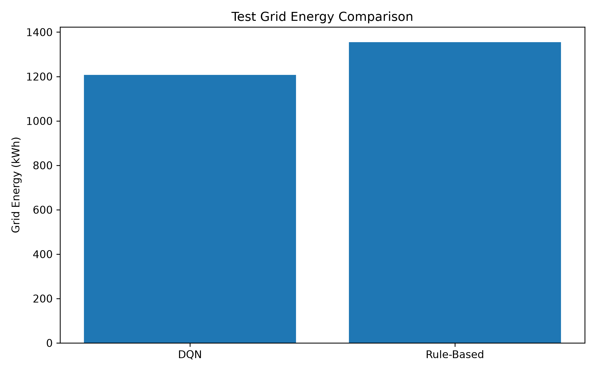

# Intelligent Energy Management System using Reinforcement Learning

This project is about using reinforcement learning for building energy management.

The main idea is to use an RL agent to decide when to charge or discharge a battery based on energy demand, solar generation, electricity price, and battery level.

I used synthetic hourly energy data and compared a DQN agent with a simple rule-based controller.

## Project Idea

The basic workflow of the project is:

Energy Data  
↓  
Energy Management Environment  
↓  
DQN Agent  
↓  
Battery Management Decisions

The agent has three possible actions:

- Use the grid normally
- Charge the battery
- Discharge the battery

The main goal is to reduce electricity cost and grid energy usage.

## Dataset

The project uses synthetic energy data generated with Python.

The dataset contains 90 days of hourly data, with 2160 rows.

The following variables are included:

- `timestamp`
- `temperature`
- `solar_generation`
- `electricity_price`
- `energy_demand`

The data generator creates simple daily and seasonal patterns for temperature, energy demand, solar generation, and electricity price.

## Train and Test Split

The data was split chronologically rather than randomly.

This makes more sense for this type of time-based problem because the model is trained on earlier data and tested on later data.

- Training data: 1447 rows
- Testing data: 713 rows

Training period:

`2025-01-01` to `2025-03-02`

Testing period:

`2025-03-02` to `2025-03-31`

## Energy Environment

I created a custom Gymnasium environment for the energy management problem.

The environment provides the agent with:

- Temperature
- Solar generation
- Electricity price
- Energy demand
- Battery level

The action space contains three actions:

```text
0 = Normal / Grid
1 = Charge Battery
2 = Discharge Battery
```

The battery capacity is 10 kWh and the maximum charge and discharge rate is 3 kWh per step.

The reward is based on electricity cost:

```text
reward = - electricity cost
```

This means that lower electricity cost gives a higher reward.

## DQN Model

For the reinforcement learning part, I used a Deep Q-Network (DQN).

The model was trained using Stable-Baselines3.

Main training settings:

- Learning rate: 0.001
- Batch size: 64
- Discount factor: 0.99
- Training steps: 50,000

The trained model is saved in:

```text
results/dqn_energy_management
```

## Rule-Based Controller

I also implemented a simple rule-based controller as a baseline.

It uses:

- Solar generation
- Energy demand
- Electricity price
- Battery level

The controller charges the battery when there is solar surplus or when electricity prices are low.

It discharges the battery during higher electricity prices when there is enough energy in the battery.

## Test Results

The final comparison was performed on the test dataset.

| Method | Electricity Cost | Grid Energy |
|---|---:|---:|
| DQN | 225.60 | 1207.45 kWh |
| Rule-Based | 197.45 | 1355.12 kWh |

The results show a trade-off between the two approaches.

The DQN used less grid energy during the test period, while the rule-based controller resulted in a lower electricity cost.

The final battery levels were:

| Method | Final Battery |
|---|---:|
| DQN | 3.18 kWh |
| Rule-Based | 0.00 kWh |

## Visualizations

The project includes several visualizations.

### Energy Demand and Solar Generation



### Battery Level - Rule-Based Controller



### Battery Level - DQN



### Electricity Cost Comparison



### Grid Energy Comparison



The plotting scripts are located in:

```text
src/visualize_data.py
src/plot_results.py
src/compare_results.py
## Project Structure

```text
intelligent-energy-management-rl/
│
├── data/
│   ├── raw/
│   │   └── energy_data.csv
│   │
│   └── processed/
│       ├── train_data.csv
│       └── test_data.csv
│
├── src/
│   ├── __init__.py
│   ├── data_generator.py
│   ├── visualize_data.py
│   ├── prepare_data.py
│   ├── energy_environment.py
│   ├── test_environment.py
│   ├── train_dqn.py
│   ├── evaluate_dqn.py
│   ├── rule_based_controller.py
│   ├── plot_results.py
│   └── compare_results.py
│
├── notebooks/
│
├── results/
│   ├── dqn_energy_management.zip
│   └── comparison.csv
│
├── requirements.txt
└── README.md
```

## How to Run

Install the required packages:

```bash
pip install -r requirements.txt
```

Generate the dataset:

```bash
python src/data_generator.py
```

Split the data:

```bash
python src/prepare_data.py
```

Test the environment:

```bash
python src/test_environment.py
```

Train the DQN model:

```bash
python src/train_dqn.py
```

Evaluate the DQN model:

```bash
python src/evaluate_dqn.py
```

Run the rule-based controller:

```bash
python src/rule_based_controller.py
```

Create the visualizations:

```bash
python src/visualize_data.py
python src/plot_results.py
python src/compare_results.py
```

## Tools and Libraries

- Python
- NumPy
- Pandas
- Matplotlib
- Gymnasium
- Stable-Baselines3
- PyTorch

## Limitations

This project uses synthetic data, so it does not represent a specific real building.

The energy environment is also a simplified version of a building energy management system.

The current version focuses on the main idea of using reinforcement learning for battery and grid management rather than modelling every part of a real building.

## Future Improvements

Some possible improvements for the next version are:

- Test PPO in addition to DQN
- Use real building energy data
- Add more realistic battery behaviour
- Add peak-demand metrics
- Experiment with different reward functions
- Compare more control strategies

## Conclusion

This project explores how reinforcement learning can be used for energy management.

The DQN agent and the rule-based controller showed different behaviour on the test data. In particular, the DQN reduced grid energy usage, while the rule-based controller achieved a lower electricity cost.

The project can be extended later with real energy data and other reinforcement learning methods.